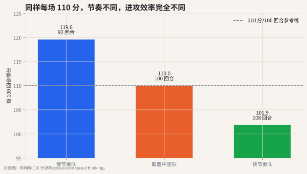

# 01 回合与节奏

## 这个指标想解决什么问题

篮球比赛表面上是 48 分钟，但分析时更好的基本单位是 **回合**。因为球队得分不是按时间自然产生的，而是由一次次进攻机会产生的。

如果两支球队都得 110 分：

- 一支用了 92 个回合；
- 另一支用了 108 个回合；

它们的进攻表现并不一样。前者每次机会更值钱，后者可能只是打得更快。



## 真实数据怎么读

上图使用 `surennba_stats` 的 30 支球队常规赛统计。左图是 **PACE 分布**：本季球队节奏中位数大约在 99.7 回合/48 分钟，慢队和快队之间能差出接近 9 个回合。右图把 PACE 和进攻效率放在一起看：你会发现节奏快并不自动等于进攻好。

读这张图时要分两步：

1. 先看横轴：球队每 48 分钟大约有多少进攻机会。
2. 再看纵轴：每 100 次机会能换回多少分。

这就是回合制分析的第一课：**场均得分是机会数量和机会质量混在一起的结果**。如果不先拆开，很容易把“打得快”误读成“打得好”。

## 直觉解释

回合可以理解成“一次连续控球”。一次进攻通常会因为以下事件结束：

- 投篮命中；
- 投篮不中后被对手抢到防守篮板；
- 罚球回合结束；
- 失误；
- 单节结束等特殊情况。

关键点是：**进攻篮板不会开启新回合，它只是延长同一个回合。**

所以，一支球队抢到前场篮板后又出手一次，这不是“多了一个完整新回合”，而是在同一次进攻机会里获得了第二次尝试。

## 公式

公开数据里通常用估算公式：

$$
POSS = FGA + 0.44 \times FTA - OREB + TOV
$$

其中：

- `FGA`：投篮出手；
- `FTA`：罚球出手；
- `OREB`：进攻篮板；
- `TOV`：失误；
- `0.44`：估算罚球中有多少比例会结束一个回合。

节奏通常写成：

$$
PACE = \frac{POSS \times 48}{MIN}
$$

也就是每 48 分钟大约有多少回合。

## 常见误读

**误读：场均得分越高，进攻越好。**

不一定。快节奏球队天然拥有更多进攻机会。要比较进攻质量，应该看每 100 回合得分，也就是进攻效率。

## 代码入口

```python
from nba_textbook.metrics import possessions, pace, offensive_rating

poss = possessions(fga=90, fta=24, oreb=10, tov=13)
team_pace = pace(poss, minutes=48)
ortg = offensive_rating(points=114, possessions_value=poss)
```

## 读图结论

真实球队图说明：同样是高场均得分，可能来自快节奏，也可能来自高效率。现代篮球分析常说：**先数回合，再谈效率。**
