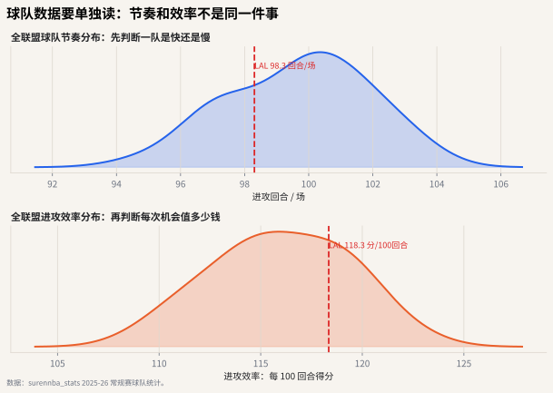

# 01 回合与节奏

## 这个指标想解决什么问题

篮球比赛表面上是 48 分钟，但分析时更好的基本单位是 **回合**。因为球队得分不是按时间自然产生的，而是由一次次进攻机会产生的。

如果两支球队都得 110 分：

- 一支用了 92 个回合；
- 另一支用了 108 个回合；

它们的进攻表现并不一样。前者每次机会更值钱，后者可能只是打得更快。

这一章先从球队讲起，因为回合和节奏是所有球员数据的背景。如果不知道一支球队创造了多少进攻机会，就很容易把“场均更多”误读成“能力更强”。




## 直觉解释

回合可以理解成“一次连续控球”。一次进攻通常会因为以下事件结束：

- 投篮命中；
- 投篮不中后被对手抢到防守篮板；
- 罚球回合结束；
- 失误；
- 单节结束等特殊情况。

关键点是：**进攻篮板不会开启新回合，它只是延长同一个回合。**

所以，一支球队抢到前场篮板后又出手一次，这不是“多了一个完整新回合”，而是在同一次进攻机会里获得了第二次尝试。

## 公式

公开数据里通常用估算公式：

$$
POSS = FGA + 0.44 \times FTA - OREB + TOV
$$

其中：

- `FGA`：投篮出手；
- `FTA`：罚球出手；
- `OREB`：进攻篮板；
- `TOV`：失误；
- `0.44`：估算罚球中有多少比例会结束一个回合。

节奏通常写成：

$$
PACE = \frac{POSS \times 48}{MIN}
$$

也就是每 48 分钟大约有多少回合。

## 从球队到球员的衔接

回合与节奏本身不是 Austin Reaves 的个人评价指标，但它决定了后面所有个人数据的解释方式。比如一名球员场均得分上涨，可能来自三种不同原因：

1. 球队节奏变快，全队机会变多；
2. 他上场时间变多；
3. 他真的承担了更多回合或提高了效率。

后续章节会依次把这些因素拆开：第 2 章先处理上场时间和节奏，第 4 章再处理个人使用率，第 7 章处理效率。

## 常见误读

**误读：场均得分越高，进攻越好。**

不一定。快节奏球队天然拥有更多进攻机会。要比较进攻质量，应该看每 100 回合得分，也就是进攻效率。

## 分布图怎么读

这一章是球队概念，所以不要混入球员位置。读图分两步：

1. 看上方面板：球队每场大约有多少进攻回合，判断它是快节奏还是慢节奏。
2. 看下方面板：同样放到每 100 回合后，它每次机会的产出在联盟里处在什么位置。

以湖人（LAL）为例，如果节奏靠右但进攻效率不靠右，说明“得分快”可能更多来自机会数量；如果效率靠右，即使节奏普通，也代表每次进攻机会更值钱。

## 代码入口

```python
from nba_textbook.metrics import possessions, pace, offensive_rating

poss = possessions(fga=90, fta=24, oreb=10, tov=13)
team_pace = pace(poss, minutes=48)
ortg = offensive_rating(points=114, possessions_value=poss)
```

## 读图结论

同样每场 110 分，如果只用了 92 个回合，进攻效率会接近 120 分/100 回合；如果用了 108 个回合，效率只有约 102 分/100 回合。这就是为什么现代篮球分析常说：**先数回合，再谈效率。** 球队层面先这样读清楚，个人层面才不会把节奏红利误当成球员能力。
