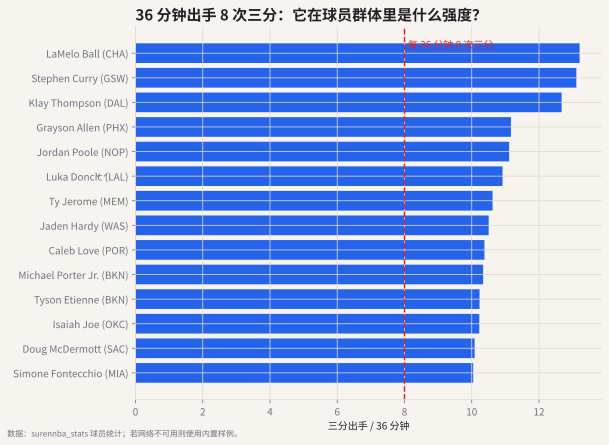

# 02 总量、每 36 分钟、每 100 回合

## 这个指标想解决什么问题

场均数据最大的问题是：它混在一起比较了三件事。

1. 球员能力；
2. 出场时间；
3. 球队节奏和角色。

一个替补场均 8 分不一定弱，可能只是每场只打 16 分钟。一个快节奏球队球员场均篮板更多，也不一定真的更会抢板，可能只是比赛里有更多投篮和更多篮板机会。

## 每 36 分钟

每 36 分钟的思想很简单：

$$
STAT\_{per36} = \frac{STAT}{MIN} \times 36
$$

它问的是：如果这个球员维持同样生产频率，打 36 分钟会留下多少数据？

这不是预测，也不是说替补真的能打 36 分钟。它只是把上场时间差异先拿掉。



## 这个数据怎么看？

这张图过滤了至少 500 分钟、至少 20 次三分出手的球员。左图是球员三分出手/36 分钟的 **密度图**：虚线是联盟中位数，灰色线是 8 次/36 分钟参考线，红线是 Austin Reaves。

在这份数据里，500+ 分钟球员的三分出手中位数约为 **5.8 次/36 分钟**。按位置看，后卫中位数约 **7.5**，锋线约 **5.1**，中锋约 **1.0**。这说明“每 36 分钟 8 次三分”不是普通水平，而是明显偏高的空间参与频率。

Austin Reaves 在这份数据里大约是 **6.7 次/36 分钟**。这说明他不是低产射手，但也还没有到 8 次线以上那种“高产三分机器”。所以你不能只说“他 36 分钟投 6.7 个三分，好不好？”更好的读法是：他高于普通球员中位数，但低于顶级高产射手线；再结合 36.0% 的三分命中率，才可以说他具备稳定空间价值，但不是那种极端产量型射手。

更具体地说，达到 8 次/36 分钟这条线的球员大约只占 500+ 分钟样本的 **15.6%**。所以它不是“会投一点三分”，而是“球队进攻经常把三分出手交给他”。

## 每 100 回合

每 100 回合进一步拿掉节奏差异：

$$
STAT\_{per100} = \frac{STAT}{POSS} \times 100
$$

它问的是：每拥有 100 次进攻机会，这个球员或球队大约产出多少？

## 如何理解“36 分钟出手 8 次三分”

36 分钟 8 次三分，直觉上等于：

$$
\frac{36}{8} = 4.5
$$

也就是每 4.5 分钟就尝试一次三分。

如果按一名主力一场打 36 分钟理解，这已经不是“偶尔投一下”，而是球队进攻结构里稳定的一部分。它可能对应：

- 持球核心大量借掩护三分；
- 无球射手持续绕掩护和接球投；
- 空间型锋线/中锋站在三分线外拉开防守。

## 常见误读

**误读：per36 高，就说明球员真能当主力。**

per36 只消除了时间差异，没有消除对手强度、体能、犯规、战术地位和防守注意力。它适合做“频率比较”，不适合单独做“能力定论”。

## 代码入口

```python
from nba_textbook.metrics import per_minutes, per_possessions

fg3a_per36 = per_minutes(value=160, minutes=720, target_minutes=36)
points_per100 = per_possessions(value=1200, possessions_value=1800)
```

## 读图结论

当一个球员三分出手达到每 36 分钟 8 次，他已经进入高三分参与区间。接下来要继续问：他是高产高效，还是只是高产？这会在三分出手量章节继续讨论。
