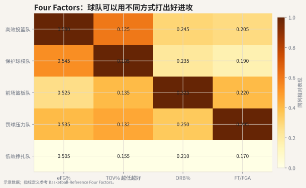
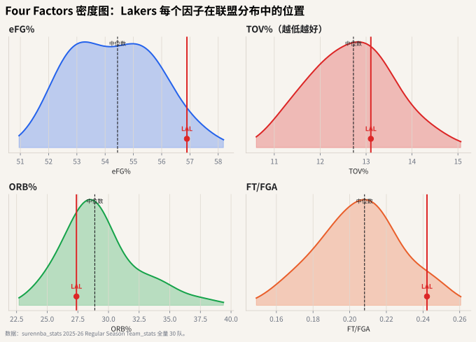

# 03 Four Factors

## 这个指标想解决什么问题

Dean Oliver 提出的 Four Factors 试图回答一个基础问题：

> 一支球队为什么能赢球？

它把进攻拆成四件事：

1. 投得准；
2. 少失误；
3. 抢回自己的投丢；
4. 通过罚球获得收益。

同一套逻辑也可以反过来看防守：让对手投不准、逼对手失误、保护后场篮板、少送对手罚球。



## 这个数据怎么看？



这张图不再用示意队伍，而是用真实 30 队数据分别画出 Four Factors 的密度图。红线标出 Lakers，虚线是联盟中位数。这样读 Four Factors 会更直观：不要只看某队 eFG% 是 56% 或 TOV% 是 13%，而要看它在全联盟分布中偏左、居中还是偏右。

读图时可以问四个问题：

1. 这支球队是不是靠 eFG% 把投篮价值打高？
2. 它的 TOV% 是否足够低，能不能保护球权？
3. 它是否用 ORB% 把投丢变成二次机会？
4. 它的 FT/FGA 是否说明球队能持续从罚球线拿分？

真实数据会让你看到：同一支球队可能投篮效率在右侧、失误率在中间、前场篮板在左侧。Four Factors 的价值就在于把“进攻为什么好或不好”拆开，而不是只说这支队进攻效率高。

## 四个指标

### 1. eFG%：投篮效率

$$
eFG\% = \frac{FGM + 0.5 \times 3PM}{FGA}
$$

三分比两分多 1 分，所以 eFG% 给命中的三分额外加 0.5 次命中。

### 2. TOV%：失误率

$$
TOV\% = \frac{TOV}{FGA + 0.44 \times FTA + TOV}
$$

它衡量多少进攻机会在出手前就浪费了。

### 3. ORB%：进攻篮板率

$$
ORB\% = \frac{ORB}{ORB + OppDRB}
$$

它衡量本队抢到了多少可抢的进攻篮板。

### 4. FT/FGA：罚球率

$$
FT/FGA = \frac{FTM}{FGA}
$$

它粗略衡量球队从罚球线获得了多少收益。

## 常见误读

**误读：Four Factors 是四个互相独立的按钮。**

实际上它们会互相影响。比如更积极冲抢进攻篮板可能牺牲退防；更高使用率的持球核心可能带来更多罚球，也可能带来更多失误。

## 代码入口

```python
from nba_textbook.metrics import four_factors

factors = four_factors(
    fgm=42,
    fg3m=14,
    fga=88,
    fta=25,
    ftm=20,
    oreb=11,
    opponent_dreb=31,
    tov=13,
)
```

## 读图结论

好进攻不一定长得一样。有的球队靠投篮效率，有的靠少失误，有的靠前场篮板续命，有的靠造罚球。Four Factors 的价值在于：它把“球队风格”翻译成几组可以比较的数字。
