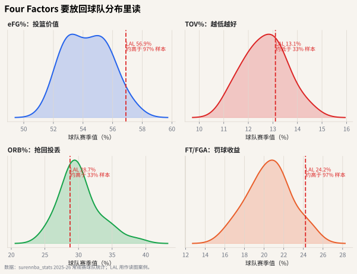

# 03 Four Factors

## 这个指标想解决什么问题

Dean Oliver 提出的 Four Factors 试图回答一个基础问题：

> 一支球队为什么能赢球？

它把进攻拆成四件事：

1. 投得准；
2. 少失误；
3. 抢回自己的投丢；
4. 通过罚球获得收益。

同一套逻辑也可以反过来看防守：让对手投不准、逼对手失误、保护后场篮板、少送对手罚球。

这章继续留在球队层面。原因很简单：Four Factors 描述的是一支球队如何把进攻机会转化成胜负优势，而不是某个球员单独能完成的全部事情。球员会影响这些因素，但不能把球队结果直接归因给一个人。




## 四个指标

### 1. eFG%：投篮效率

$$
eFG\% = \frac{FGM + 0.5 \times 3PM}{FGA}
$$

三分比两分多 1 分，所以 eFG% 给命中的三分额外加 0.5 次命中。

### 2. TOV%：失误率

$$
TOV\% = \frac{TOV}{FGA + 0.44 \times FTA + TOV}
$$

它衡量多少进攻机会在出手前就浪费了。

### 3. ORB%：进攻篮板率

$$
ORB\% = \frac{ORB}{ORB + OppDRB}
$$

它衡量本队抢到了多少可抢的进攻篮板。

### 4. FT/FGA：罚球率

$$
FT/FGA = \frac{FTM}{FGA}
$$

它粗略衡量球队从罚球线获得了多少收益。

这四个指标合起来，等于把“进攻好不好”拆成四条路径。球队可能不是每项都强，但只要其中几项足够突出，也可能形成稳定进攻风格。

## 常见误读

**误读：Four Factors 是四个互相独立的按钮。**

实际上它们会互相影响。比如更积极冲抢进攻篮板可能牺牲退防；更高使用率的持球核心可能带来更多罚球，也可能带来更多失误。

## 分布图怎么读

Four Factors 是球队层面的概念，所以本章使用球队统计表，不和 Austin Reaves 的个人指标混在一张图里。

读图顺序：

1. **eFG%**：先看球队投篮价值在联盟分布中偏左还是偏右。
2. **TOV%**：失误率越低越好，所以靠左反而更健康。
3. **ORB%**：看球队是否通过前场篮板延长回合。
4. **FT/FGA**：看罚球收益是否是进攻结构的一部分。

热力图适合横向比较不同球队的风格；密度图适合回答“某队某一项到底在联盟里算不算突出”。

如果你想把 Four Factors 和 Austin Reaves 联系起来，正确问题不是“Reaves 的 Four Factors 是多少”，而是：

- 湖人的进攻是否依赖高 eFG% 或高罚球收益？
- Reaves 的使用率、TS% 和造罚球是否支持了这种球队结构？
- 当他在队内承担更多回合时，球队层面的失误和效率会不会受影响？

也就是说，球队图提供背景，球员图提供角色证据。

## 代码入口

```python
from nba_textbook.metrics import four_factors

factors = four_factors(
    fgm=42,
    fg3m=14,
    fga=88,
    fta=25,
    ftm=20,
    oreb=11,
    opponent_dreb=31,
    tov=13,
)
```

## 读图结论

好进攻不一定长得一样。有的球队靠投篮效率，有的靠少失误，有的靠前场篮板续命，有的靠造罚球。Four Factors 的价值在于：它把“球队风格”翻译成几组可以比较的数字，并且这些数字必须放回球队分布里读。读完球队风格后，才进入个人层面：谁在这个体系里用掉回合，谁负责把机会变成得分。
