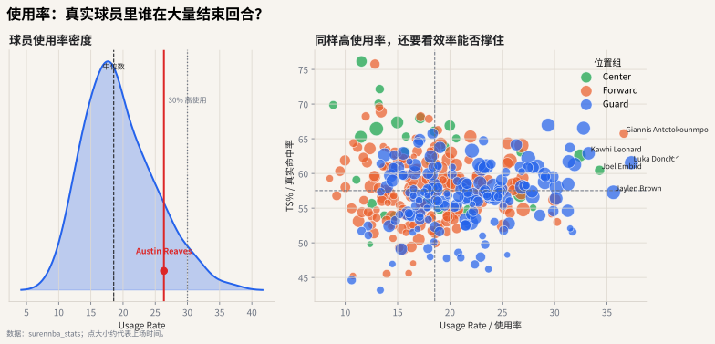

# 04 使用率：谁结束了进攻回合

## 这个指标想解决什么问题

使用率（Usage Rate, USG%）经常被误解成“持球时间”。它真正想描述的是：

> 当这个球员在场时，球队有多少进攻回合由他用投篮、罚球或失误结束？

所以使用率不是控球时间指标，而是 **回合终结指标**。



## 直觉解释

一个球员可以不长时间运球，但仍然有高使用率：比如他大量接球就投、低位终结、被犯规罚球。反过来，一个控卫可能持球很久，但如果主要是在组织传导，他的使用率未必最高。

使用率里的“用掉回合”通常包括：

- 投篮出手；
- 造成罚球；
- 失误。

## 公式

常见估算公式是：

$$
USG\% =
100 \times
\frac{(FGA + 0.44 \times FTA + TOV) \times TeamMinutes}
{(TeamFGA + 0.44 \times TeamFTA + TeamTOV) \times PlayerMinutes}
$$

这个公式的关键是把球员使用机会放回球队整体机会里比较。

## 常见误读

**误读 1：使用率越高，球员越好。**

不一定。高使用率说明他承担了更多回合终结责任，但好不好还要看效率、失误、传球价值和对防守的牵制。

**误读 2：使用率低就是没用。**

也不一定。低使用率高效率球员可能是优秀空间点、终结点或防守型角色球员。他们不负责消化大量回合，但能让高使用率核心更舒服。

## 代码入口

```python
from nba_textbook.metrics import usage_rate

usg = usage_rate(
    player_fga=18,
    player_fta=8,
    player_tov=4,
    team_fga=90,
    team_fta=24,
    team_tov=13,
    player_minutes=36,
    team_minutes=240,
)
```

## 读图结论

横轴越靠右，说明球员越多负责终结回合；纵轴越高，说明终结效率越好。真正稀缺的是右上角：既能大量消化回合，又能维持高效率。
