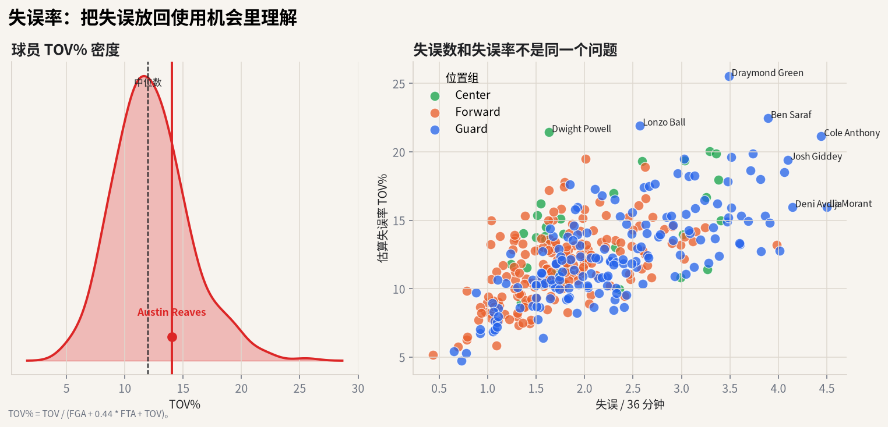

# 05 失误率：同样 3 次失误，意义可能不同

## 这个指标想解决什么问题

失误数是总量。它没有告诉你一个球员承担了多少进攻责任。

同样 3 次失误：

- 如果来自一个使用率很高的持球核心，可能是大量处理球的副产品；
- 如果来自一个几乎只接球投篮的角色球员，问题就更严重。

失误率想解决的就是这个比较问题。



## 直觉解释

失误率不是问“你失误了几次”，而是问：

> 在你可能结束进攻的机会里，有多少比例变成了失误？

这比失误数更接近“浪费机会的频率”。

## 公式

常见球员/球队估算：

$$
TOV\% = \frac{TOV}{FGA + 0.44 \times FTA + TOV}
$$

分母近似表示投篮、罚球和失误这些回合终结机会。

## 常见误读

**误读：助攻多的球员失误多，所以不稳。**

要看角色。高传球量和高持球量通常带来更高失误数。更公平的读法是结合：

- 使用率；
- 助攻率；
- 失误率；
- 球队进攻效率；
- 比赛情境和对手防守强度。

## 代码入口

```python
from nba_textbook.metrics import turnover_pct

tov_pct = turnover_pct(tov=3, fga=18, fta=8)
```

## 读图结论

图里横轴是每 36 分钟失误数，纵轴是估算失误率。真正需要警惕的是右上角：失误频率高，而且在可使用机会中占比也高。只有失误数高，不一定等于处理球差。
