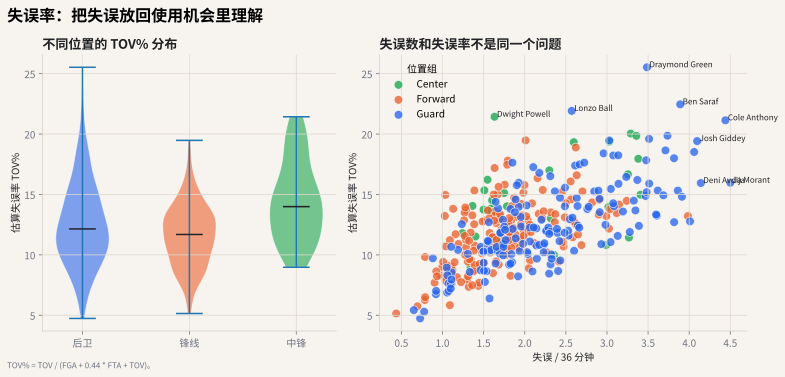
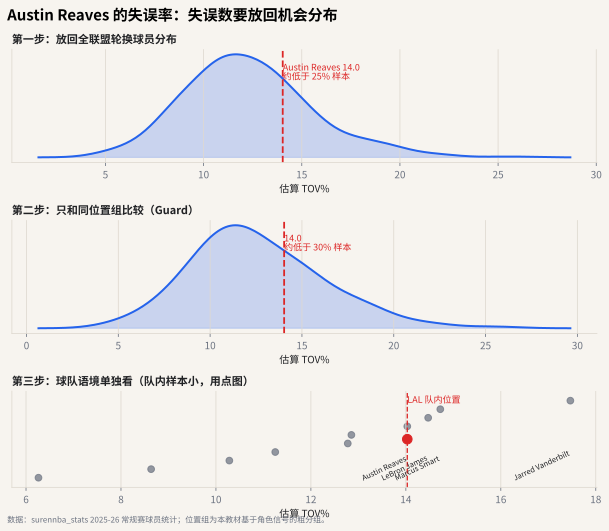

# 05 失误率：同样 3 次失误，意义可能不同

## 这个指标想解决什么问题

失误数是总量。它没有告诉你一个球员承担了多少进攻责任。

同样 3 次失误：

- 如果来自一个使用率很高的持球核心，可能是大量处理球的副产品；
- 如果来自一个几乎只接球投篮的角色球员，问题就更严重。

失误率想解决的就是这个比较问题。

上一章看的是“谁用掉回合”。这一章接着问：当一个球员承担这些回合时，有多少机会在出手前就被浪费了？





## 直觉解释

失误率不是问“你失误了几次”，而是问：

> 在你可能结束进攻的机会里，有多少比例变成了失误？

这比失误数更接近“浪费机会的频率”。

## 公式

常见球员/球队估算：

$$
TOV\% = \frac{TOV}{FGA + 0.44 \times FTA + TOV}
$$

分母近似表示投篮、罚球和失误这些回合终结机会。

这也是为什么失误率要和使用率一起读。一个几乎不处理球的球员，失误率低并不稀奇；一个经常发起挡拆、突破分球、被包夹的球员，能把失误率控制在合理区间，才更有解释价值。

## 常见误读

**误读：助攻多的球员失误多，所以不稳。**

要看角色。高传球量和高持球量通常带来更高失误数。更公平的读法是结合：

- 使用率；
- 助攻率；
- 失误率；
- 球队进攻效率；
- 比赛情境和对手防守强度。

## Austin Reaves 案例：低不是一定好，高也不是一定坏

失误率图要反着读：越靠左，说明在估算终结机会中变成失误的比例越低。

1. **全联盟分布**：先看 Reaves 的 TOV% 是在低失误区、中间区，还是高失误区。
2. **同位置分布**：后卫处理球更多，同位置失误率通常更能反映控球压力。
3. **湖人队内语境**：如果队内只有主控和二传手失误率偏高，可能是角色造成；如果低使用率球员也偏高，就要警惕处理球质量。

因此失误率必须和使用率一起看：低使用率低失误不一定代表控球好，高使用率中等失误可能反而是可接受的成本。

读 Reaves 时，先看他在后卫组里的 TOV% 分布位置，再回头看第 4 章的 USG%。如果使用率和失误率都偏高，说明他可能承担了更复杂的持球任务；如果使用率偏高但失误率仍在可控区间，就能支持“二级持球点”这样的角色判断。

## 代码入口

```python
from nba_textbook.metrics import turnover_pct

tov_pct = turnover_pct(tov=3, fga=18, fta=8)
```

## 读图结论

图里横轴是每 36 分钟失误数，纵轴是估算失误率。真正需要警惕的是右上角：失误频率高，而且在可使用机会中占比也高。只有失误数高，不一定等于处理球差。使用率告诉你责任，失误率告诉你责任的风险成本。
