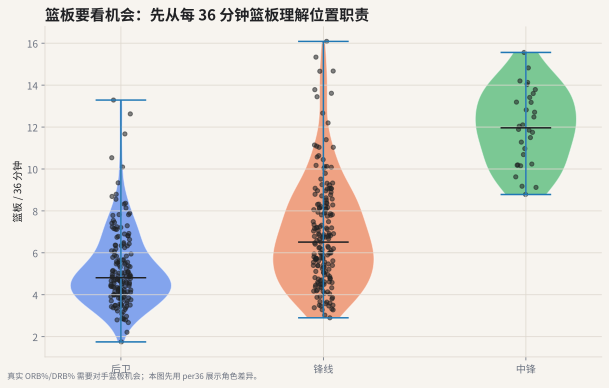

# 06 篮板率：从“抢了几个”到“抢到了多少机会”

## 这个指标想解决什么问题

篮板数看起来直观，但它也受很多外部因素影响：

- 球队和对手投丢了多少球；
- 球员打了多少分钟；
- 球员位置和防守任务；
- 球队是否要求后卫回收篮板或提前快下。

篮板率想问的是：

> 在可抢篮板机会里，你抢到了多少？



## 真实数据怎么读

左图先用每 36 分钟篮板做分位置分布：在 500+ 分钟样本中，中锋篮板中位数约 **12.0 个/36 分钟**，锋线约 **6.5**，后卫约 **4.8**。这符合直觉，也提醒我们：篮板必须放在位置职责里读。

右图进一步使用 `surennba_stats` 表里的真实篮板率字段，把进攻篮板机会占比和防守篮板机会占比放在一起。它比单纯篮板数更接近“机会利用率”：

- 右侧更高：更积极或更有效地参与前场篮板。
- 上侧更高：更强的后场篮板保护。
- 右上：两端篮板都强，通常是内线或强篮板锋线。

这也是为什么只说“某球员场均 8 个篮板”还不够。你还要问：他打了多久？他的位置是什么？他在可抢篮板机会里拿到了多少？

## 进攻篮板率

$$
ORB\% = \frac{ORB}{ORB + OppDRB}
$$

它描述本队投丢后，球员或球队把球抢回来的能力。

## 防守篮板率

$$
DRB\% = \frac{DRB}{DRB + OppORB}
$$

它描述对手投丢后，本方结束防守回合的能力。

## 为什么篮板率比篮板数更公平

一个中锋场均 10 篮板，一个后卫场均 6 篮板，不能直接说前者一定“篮板影响力多 67%”。你需要知道：

- 他们打了多少分钟；
- 他们在场时有多少可抢篮板；
- 他们的位置任务是否允许冲抢前场篮板；
- 他们是否负责卡位而不是直接拿板。

## 常见误读

**误读：篮板数低就是篮板差。**

有些球员的价值在卡位、把对手大个子挡出篮板区；有些球队让后卫拿后场篮板来提速。公开数据里的篮板率比篮板数更好，但仍然不能完全替代录像。

## 代码入口

```python
from nba_textbook.metrics import offensive_rebound_pct, defensive_rebound_pct

orb_pct = offensive_rebound_pct(oreb=11, opponent_dreb=31)
drb_pct = defensive_rebound_pct(dreb=34, opponent_oreb=9)
```

## 读图结论

本章图先用每 36 分钟篮板展示位置差异：中锋通常天然更高，锋线居中，后卫更低。下一步如果有完整对手篮板机会数据，应进一步换成 ORB% 和 DRB%。
