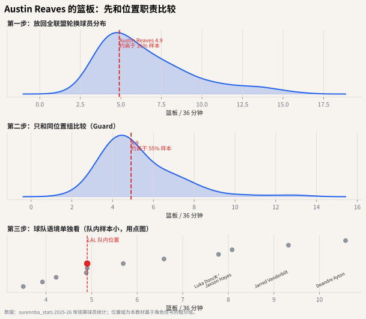

# 06 篮板率：从“抢了几个”到“抢到了多少机会”

## 这个指标想解决什么问题

篮板数看起来直观，但它也受很多外部因素影响：

- 球队和对手投丢了多少球；
- 球员打了多少分钟；
- 球员位置和防守任务；
- 球队是否要求后卫回收篮板或提前快下。

篮板率想问的是：

> 在可抢篮板机会里，你抢到了多少？

前两章讨论的是进攻回合如何被使用和浪费。本章换一个角度：当投篮没进时，谁帮助球队把回合拿回来，或者结束对手的回合？




## 进攻篮板率

$$
ORB\% = \frac{ORB}{ORB + OppDRB}
$$

它描述本队投丢后，球员或球队把球抢回来的能力。

## 防守篮板率

$$
DRB\% = \frac{DRB}{DRB + OppORB}
$$

它描述对手投丢后，本方结束防守回合的能力。

篮板是最容易被位置误导的指标之一。中锋站在篮下，天然更接近篮板机会；后卫可能负责退防、卡位、接应推进，直接篮板数不一定代表全部贡献。

## 为什么篮板率比篮板数更公平

一个中锋场均 10 篮板，一个后卫场均 6 篮板，不能直接说前者一定“篮板影响力多 67%”。你需要知道：

- 他们打了多少分钟；
- 他们在场时有多少可抢篮板；
- 他们的位置任务是否允许冲抢前场篮板；
- 他们是否负责卡位而不是直接拿板。

## 常见误读

**误读：篮板数低就是篮板差。**

有些球员的价值在卡位、把对手大个子挡出篮板区；有些球队让后卫拿后场篮板来提速。公开数据里的篮板率比篮板数更好，但仍然不能完全替代录像。

## Austin Reaves 案例：先把位置职责拆开

surennba 的公开球员总表可以稳定给出篮板数、进攻篮板、防守篮板和分钟，但单个球员在场时的完整篮板机会需要更细的 on/off 或 play-by-play 数据。因此本章的个人案例先用 `rebounds_per36` 做频率读法：

1. **全联盟分布**：先看 Reaves 的篮板频率在所有轮换球员里大致在哪。
2. **同位置分布**：后卫和中锋篮板职责差异很大，同位置图比全联盟图更关键。
3. **湖人队内语境**：队内点图能帮助你判断他的篮板是后场保护的一部分，还是只是位置自然差异。

这张图不能单独回答“篮板影响力”，它回答的是“以他的上场时间和位置，篮板频率是否异常”。

对 Reaves 的合理问题不是“为什么他不像中锋那样抢板”，而是“在后卫组里，他的篮板频率是否提供了额外回合价值”。如果他在同位置分布里偏右，再结合球队是否需要后卫回收篮板推进，就能形成更具体的角色解释。

## 代码入口

```python
from nba_textbook.metrics import offensive_rebound_pct, defensive_rebound_pct

orb_pct = offensive_rebound_pct(oreb=11, opponent_dreb=31)
drb_pct = defensive_rebound_pct(dreb=34, opponent_oreb=9)
```

## 读图结论

本章图先用每 36 分钟篮板展示位置差异：中锋通常天然更高，锋线居中，后卫更低。下一步如果有完整对手篮板机会数据，应进一步换成 ORB% 和 DRB%。到这里，角色阅读已经有三块拼图：回合责任、失误成本和回合回收。
