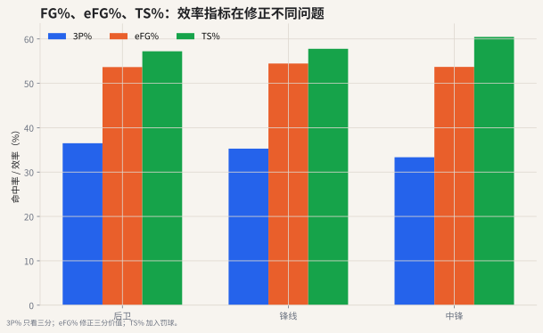

# 07 投篮效率：FG%、eFG%、TS%

## 这个指标想解决什么问题

传统命中率 FG% 的问题是：它把两分和三分当成同一种命中。

一个球员 10 投 5 中：

- 如果 5 个全是两分，得到 10 分；
- 如果 5 个全是三分，得到 15 分。

FG% 都是 50%，但进攻价值完全不同。



## 真实数据怎么读

这张图左侧比较不同位置的 3P%、eFG%、TS% 中位数，右侧直接看 TS% 分布。样本过滤为至少 500 分钟、至少 50 次三分出手。

这份真实数据里，TS% 的位置中位数大致在 **57% 左右**，锋线、后卫和中锋差距不大。但这不代表他们的进攻方式一样：有的人靠三分，有的人靠篮下和罚球，有的人靠中距离与高难度出手。TS% 把这些得分方式折算成整体效率，适合做第一层比较。

读图时要注意：

- 3P% 只回答远投准不准。
- eFG% 把三分比两分多 1 分的价值算进去。
- TS% 再把罚球收益算进去。

所以同一个球员可能 3P% 普通，但 TS% 很好；也可能三分很准，但因为产量小或罚球少，整体效率优势没有想象中大。

## FG%

$$
FG\% = \frac{FGM}{FGA}
$$

它回答“投篮进了多少比例”，但不区分两分和三分价值。

## eFG%

$$
eFG\% = \frac{FGM + 0.5 \times 3PM}{FGA}
$$

eFG% 把三分多出来的 1 分折算进命中率。命中一个三分相当于命中 1.5 个两分球的得分价值。

## TS%

$$
TS\% = \frac{PTS}{2 \times (FGA + 0.44 \times FTA)}
$$

TS% 进一步把罚球也纳入得分效率。它更适合评价整体终结效率，尤其是擅长造犯规的球员。

## 常见误读

**误读：FG% 低就是效率低。**

不一定。大量投三分的球员 FG% 往往不会特别高，但 eFG% 和 TS% 可能很好。反过来，一个只投近筐两分的球员 FG% 很高，也要看他有没有罚球、失误、空间价值和角色限制。

## 代码入口

```python
from nba_textbook.metrics import effective_fg_pct, true_shooting_pct

efg = effective_fg_pct(fgm=8, fg3m=4, fga=16)
ts = true_shooting_pct(points=24, fga=16, fta=4)
```

## 读图结论

三分命中率只回答“远投准不准”。eFG% 回答“投篮出手的得分价值”。TS% 回答“所有投篮和罚球机会合起来的得分效率”。现代篮球评价得分手时，通常至少要同时看出手量和 TS%。
