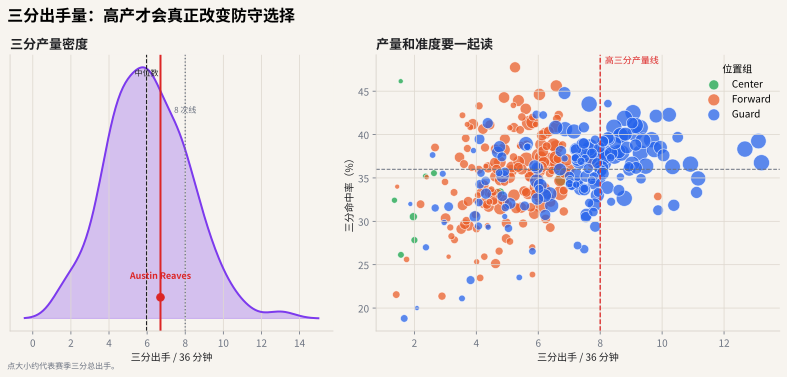

# 08 三分出手量：不只是准不准

## 这个指标想解决什么问题

三分分析最常见的误读是只看命中率。

但球队真正关心的是两个问题：

1. 你能不能投进？
2. 你愿不愿意、能不能大量投？

一个 45% 三分命中率但每 36 分钟只出手 1 次的球员，和一个 38% 但每 36 分钟出手 9 次的球员，给防守带来的压力完全不同。



## 真实数据怎么读

左图是三分出手/36 分钟的真实分布，右图把三分产量和命中率放在一起。样本过滤为至少 500 分钟、至少 50 次三分出手。

在这份数据里，高产射手非常集中：三分出手频率最高的一批球员可以超过 **11-13 次/36 分钟**。例如图表生成时的前列包括 LaMelo Ball、Stephen Curry、Klay Thompson、Grayson Allen、Jordan Poole 等。注意，这里比较的是频率，不是说他们都承担同样难度或同样战术角色。

右图的读法：

- 右上：高产高效，防守最难放。
- 右下：高产但效率一般，可能是高难度持球投或球队需要他强行消化出手。
- 左上：准但产量低，可能是样本、角色或出手速度限制。
- 左下：既不高产也不高效，空间价值有限。

## 为什么每 36 分钟三分出手重要

三分出手量代表空间参与频率。它不只是球员个人得分，还会改变防守站位：

- 防守者是否敢收缩协防；
- 挡拆时是否需要提前上抢；
- 弱侧底角是否能被放空；
- 大个子是否能把护筐人带离篮下。

## 36 分钟 8 次三分的直觉

每 36 分钟 8 次三分，等价于每 4.5 分钟一次三分尝试。这通常意味着球员不是偶尔空位才投，而是战术结构的一部分。

在图里，这条线可以被看成“高三分参与”的粗略阈值。越靠右，三分产量越高；越靠上，命中率越高。

## 常见误读

**误读：三分命中率低于 35% 就没有空间价值。**

不一定。防守是否尊重你的投篮，不只取决于赛季命中率，也取决于出手速度、出手距离、历史履历、比赛情境和球队战术。数据可以帮助发现问题，但防守选择仍然要结合录像。

## 代码入口

```python
from nba_textbook.data import prepare_player_dataset

players = prepare_player_dataset()
players[["name", "fg3a_per36", "fg3pct"]].sort_values("fg3a_per36", ascending=False)
```

## 读图结论

右上角是最稀缺的射手类型：高产且高效。右下角可能是高难度持球投、战术强投或效率问题。左上角是“准但产量低”的球员，需要继续看他为什么不多投：是角色、出手速度、对手防守，还是样本太小？
