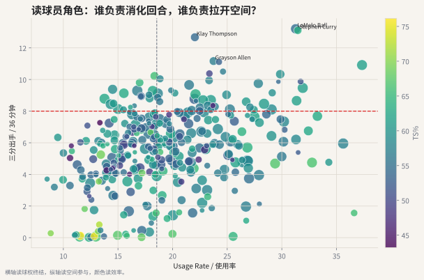
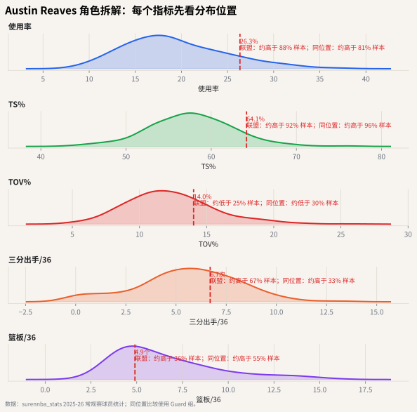

# 09 用指标阅读球员角色

## 这个章节想解决什么问题

单个指标很容易误导。真正读球员时，要把多个指标放在一起。

一个简单的角色阅读框架：

- 使用率：他负责消化多少回合？
- TS%：他消化回合时效率如何？
- 三分出手 / 36 分钟：他提供多少空间参与？
- 失误率：他浪费机会的比例高不高？
- 篮板率或 per36 篮板：他在位置职责中贡献多少回合回收？





## 直觉解释

横轴使用率高，说明球员更多负责终结进攻。纵轴三分出手多，说明他更频繁参与空间拉扯。颜色越亮，表示 TS% 越高。

这张图能帮助你快速区分几类角色：

1. **高使用核心**：横轴靠右，球队大量回合由他结束。
2. **空间射手**：纵轴靠上，三分参与频率高。
3. **高效终结点**：颜色更亮，但使用率可能不高。
4. **低空间内线**：纵轴靠下，需要用篮下效率、篮板和防守继续评价。

## 如何避免过度解读

角色图不是球员排名。它没有直接包含：

- 防守影响；
- 传球质量；
- 掩护质量；
- 无球跑动；
- 对位难度；
- 队友空间；
- 教练战术安排。

它的作用是提供一张地图：帮助你知道下一步应该看什么。

## Austin Reaves 案例：把多个分布合起来读

单个密度图只能解释一个问题。读 Reaves 这类球员时，建议按下面顺序串起来：

1. **使用率**：他是不是在承担湖人的二三级回合终结？
2. **TS%**：承担这些回合时，效率有没有保持在同位置可接受区间？
3. **TOV%**：这些处理球机会带来的失误成本是否过高？
4. **三分出手 / 36 分钟**：他是否提供足够空间参与，而不只是偶尔空位出手？
5. **篮板 / 36 分钟**：以一个后卫的职责看，他是否补充了回合回收？

仪表盘里的每一行仍然遵守同一原则：先看全联盟密度，再看同位置百分位，最后回到湖人队内角色。这样读出来的是“球员画像”，不是简单排名。

## 代码入口

```python
from nba_textbook.data import prepare_player_dataset

players = prepare_player_dataset()
role_columns = ["name", "usage", "ts_pct_calc", "fg3a_per36", "tov_pct_calc", "rebounds_per36"]
players[role_columns].head()
```

## 读图结论

现代篮球分析不应该停留在“谁场均更多”。更好的问题是：谁在什么角色中，用多高频率、以多高效率、承担了怎样的进攻和回合责任。
